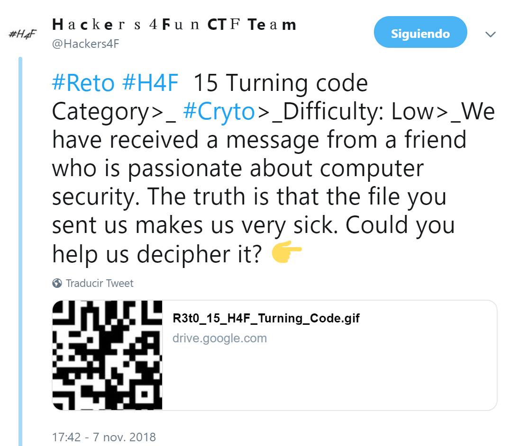

## Description

- **Name:** Turning code
- **Release date:** November 7, 2018
- **Author:** [1v4n](https://twitter.com/1r0Dm48O)
- **Category:** Crypto
- **Difficulty:** Low

- We have received a message from a friend who is passionate about computer security. The truth is that the file you sent us makes us very sick. Could you help us decipher it?

## Hint

-  [Be careful decoding and the flag is a  text in 'UPPERCASE'](https://twitter.com/Hackers4F/status/1060227203995189249)

## Objetivo

- Format of the flag: *text*

## Posted

- [Link](https://twitter.com/Hackers4F/status/1060210931316207616)

- [Artifact](https://goo.gl/gEGhhR)

## Hall of Fame

- 🥇 [@juan_i_gonzalez](https://twitter.com/juan_i_gonzalez)
- 🥈 [@Litxi](https://twitter.com/Litxi)
- 🥉 [@antoniojcaba](https://twitter.com/antoniojcaba)
- 📜 [@KALRONG](https://twitter.com/KALRONG)
- 🍪 [@julianmenendez](https://twitter.com/julianmenendez)

## Tools

- http://picasion.com/get-frames
- https://zxing.org/w/decode.jspx
- https://convert.town/ascii-to-text
- https://extremecoders-re.github.io/punch-reader/

## Writeup

- We downloaded the animated GIF image that we split into 6 frames (http://picasion.com/split-animated-gif/). We go to the reading of QR codes (https://zxing.org/w/decode.jspx) where we get
3L_4SCII_t3_4C3rC4rA_a_L4_Fl4G_071_048_048_071_076_051_102_071_119_065_049
- We decode the ASCII:
G00GL3fGwA1> URL shortener> https://goo.gl/3fGwA1
- We download the following artifact in a file called PuNc3D_C4rD_H4F_R3T0_15.png (https://en.wikipedia.org/wiki/Punched_card).
- With the help of the tool "Punched Card Reader generated by kloth.net" we obtain the flag.

Flag: H0N3YC0N18_T3_3SP3R4
