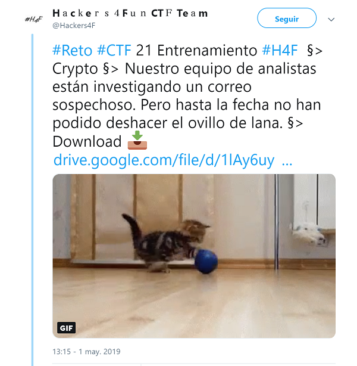
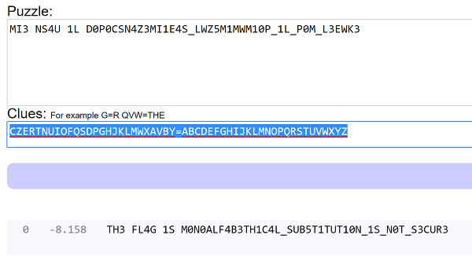

## Description

- **Name:** C1pH3rC4T
- **Release date:** May 1, 2019
- **Author:** [1v4n](https://twitter.com/1r0Dm48O)
- **Category:** Crypto
- **Difficulty:** Low-Medium

> Nuestro equipo de analistas están investigando un correo sospechoso. Pero hasta la fecha no han podido deshacer el ovillo de lana.

## Target

> [Format of the flag: H4F{UPPERCASE}](https://twitter.com/Hackers4F/status/1124256664360837122)

## Posted

- [Link](https://twitter.com/Hackers4F/status/1123682305149669377)


- [Artifact](https://drive.google.com/file/d/1lAy6uygbVOOyzwJ0EYD6jBX77ijoYWhf/view)

## Hints

>  [Vamos por buen camino al encontrar ayuda👉"quipqiup"](https://twitter.com/Hackers4F/status/1124254427236446208)

> [Necesitamos afinar más nuestro ataque a la stego y encontramos un diccionario q te puede ayudar https://github.com/nrakochy/known-passwords/blob/429693ff79c128eccaaac807747632754fbb5534/sorted/d3.txt](https://twitter.com/Hackers4F/status/1125039693152837632)

## Hall of Fame

- 🥇 [@Frantkdz](https://twitter.com/Frantkdz)

## Tools

* Mozilla Firefox 60.6.3
* gdwon https://github.com/wkentaro/gdown
* StegCracker https://github.com/Paradoxis/StegCracker
* Known Passwords https://github.com/nrakochy/known-passwords/tree/429693ff79c128eccaaac807747632754fbb5534
* https://quipqiup.com/


## Writeup

```bash
root@1v4n:~/CTF/Hackers4Fun/Reto21/poc# gdown https://drive.google.com/uc?id=1lAy6uygbVOOyzwJ0EYD6jBX77ijoYWhf
Downloading...
From: https://drive.google.com/uc?id=1lAy6uygbVOOyzwJ0EYD6jBX77ijoYWhf
To: /root/CTF/Hackers4Fun/Reto21/R3t0_21_C1pH3rC4T.7z
100%|██████████████████████████████████████████████████████████████████████████████████████| 229k/229k [00:00<00:00, 565kB/s]
root@1v4n:~/CTF/Hackers4Fun/Reto21# file R3t0_21_C1pH3rC4T.7z
R3t0_21_C1pH3rC4T.7z: 7-zip archive data, version 0.4
root@1v4n:~/CTF/Hackers4Fun/Reto21# md5sum R3t0_21_C1pH3rC4T.7z
4669b7c667f53fbb0e707eba55a0d684  R3t0_21_C1pH3rC4T.7z
root@1v4n:~/CTF/Hackers4Fun/Reto21# 7z x R3t0_21_C1pH3rC4T.7z

7-Zip [64] 16.02 : Copyright (c) 1999-2016 Igor Pavlov : 2016-05-21
p7zip Version 16.02 (locale=es_ES.UTF-8,Utf16=on,HugeFiles=on,64 bits,2 CPUs Intel(R) Core(TM) i7-6500U CPU @ 2.50GHz (406E3),ASM,AES-NI)

Scanning the drive for archives:
1 file, 228936 bytes (224 KiB)

Extracting archive: R3t0_21_C1pH3rC4T.7z
--
Path = R3t0_21_C1pH3rC4T.7z
Type = 7z
Physical Size = 228936
Headers Size = 130
Method = LZMA2:18
Solid = -
Blocks = 1

Everything is Ok

Size:       228790
Compressed: 228936
root@1v4n:~/CTF/Hackers4Fun/Reto21# file R3t0_21.jpg
R3t0_21.jpg: JPEG image data, JFIF standard 1.01, aspect ratio, density 1x1, segment length 16, baseline, precision 8, 1300x890, components 3
root@1v4n:~/CTF/Hackers4Fun/Reto21# md5sum R3t0_21.jpg
471ba614b428156dc5c4eedd1ed436e7  R3t0_21.jpg
root@1v4n:~/CTF/Hackers4Fun/Reto21# binwalk R3t0_21.jpg

DECIMAL       HEXADECIMAL     DESCRIPTION
--------------------------------------------------------------------------------
0             0x0             JPEG image data, JFIF standard 1.01

root@1v4n:~/CTF/Hackers4Fun/Reto21# steghide info R3t0_21.jpg
"R3t0_21.jpg":
  formato: jpeg
  capacidad: 13,4 KB
�Intenta informarse sobre los datos adjuntos? (s/n) s
Anotar salvoconducto:
steghide: �no pude extraer ning�n dato con ese salvoconducto!
root@1v4n:~/CTF/Hackers4Fun/Reto21/poc# stegcracker R3t0_21.jpg /usr/share/wordlists/rockyou.txt
StegCracker 2.0.7 - (https://github.com/Paradoxis/StegCracker)
Copyright (c) 2019 - Luke Paris (Paradoxis)

Counting lines in wordlist..
Attacking file 'R3t0_21.jpg' with wordlist '/usr/share/wordlists/rockyou.txt'..
^C84320/14344392 (47.30%) Attempted: k21M215716m227acomom
Error: Aborted.
root@1v4n:~/CTF/Hackers4Fun/Reto21# wget https://raw.githubusercontent.com/nrakochy/known-passwords/429693ff79c128eccaaac807747632754fbb5534/sorted/d3.txt
--2019-05-30 21:37:13--  https://raw.githubusercontent.com/nrakochy/known-passwords/429693ff79c128eccaaac807747632754fbb5534/sorted/d3.txt
Resolviendo raw.githubusercontent.com (raw.githubusercontent.com)... 151.101.0.133, 151.101.64.133, 151.101.128.133, ...
Conectando con raw.githubusercontent.com (raw.githubusercontent.com)[151.101.0.133]:443... conectado.
Petición HTTP enviada, esperando respuesta... 200 OK
Longitud: 137403 (134K) [text/plain]
Grabando a: “d3.txt”

d3.txt                          100%[====================================================>] 134,18K   409KB/s    en 0,3s    

 (409 KB/s) - “d3.txt” guardado [137403/137403]
root@1v4n:~/CTF/Hackers4Fun/Reto21# stegcracker R3t0_21.jpg d3.txt
StegCracker 2.0.7 - (https://github.com/Paradoxis/StegCracker)
Copyright (c) 2019 - Luke Paris (Paradoxis)

Counting lines in wordlist..
Attacking file 'R3t0_21.jpg' with wordlist 'd3.txt'..
Successfully cracked file with password: d3cipher57
Tried 12259 passwords
Your file has been written to: R3t0_21.jpg.out
d3cipher
root@1v4n:~/CTF/Hackers4Fun/Reto21# cat R3t0_21.jpg.out
3KwE3L_M0P_L1_p01MwM1M5ZwL_S4E1Im3z4nSc0p0d l1 U4Sn 3Im
root@1v4n:~/CTF/Hackers4Fun/Reto21# sed -i 's/.*/\U&/' R3t0_21.jpg.out
root@1v4n:~/CTF/Hackers4Fun/Reto21# cat R3t0_21.jpg.out
3KWE3L_M0P_L1_P01MWM1M5ZWL_S4E1IM3Z4NSC0P0D L1 U4SN 3IM
root@1v4n:~/CTF/Hackers4Fun/Reto21# cat R3t0_21.jpg.out | rev
MI3 NS4U 1L D0P0CSN4Z3MI1E4S_LWZ5M1MWM10P_1L_P0M_L3EWK3
```
Visitamos quipqiup y el diccionario de sustitución es CZERTNUIOFQSDPGHJKLMWXAVBY=ABCDEFGHIJKLMNOPQRSTUVWXYZ



> Flag: ***H4F{M0N0ALF4B3TH1C4L_SUB5T1TUT10N_1S_N0T_S3CUR3}***
