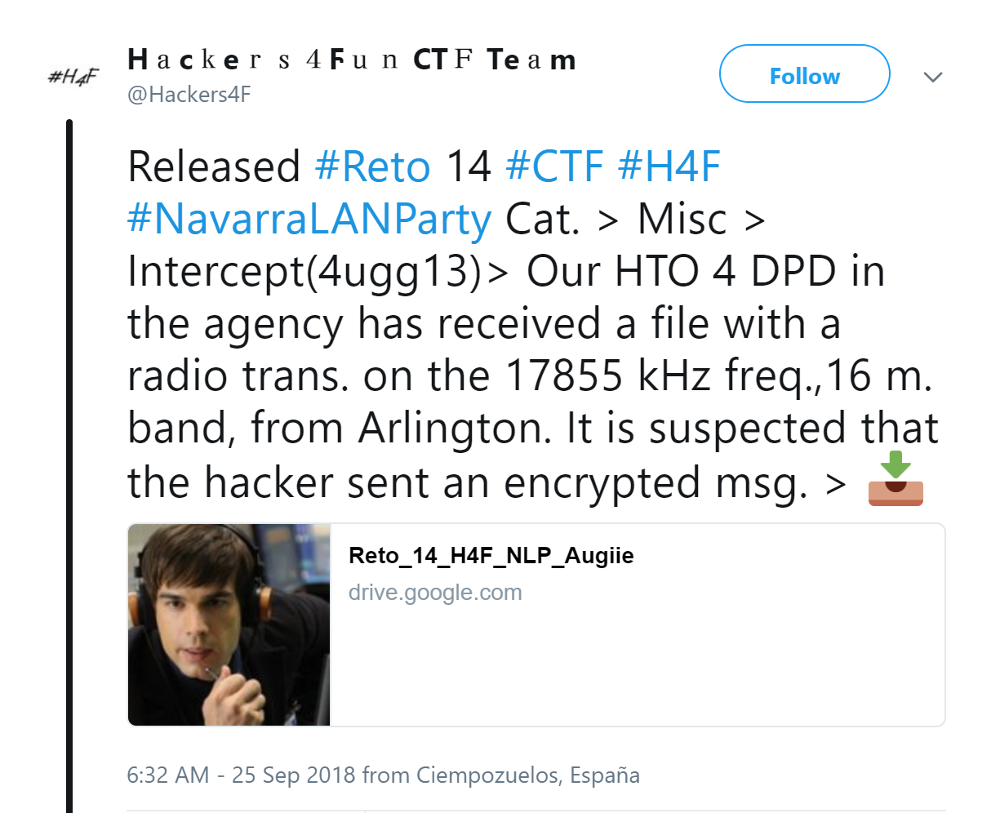

## Description

- **Name:** Intercept (4ugg13)
- **Release date:** September 25, 2018
- **Author:** [1v4n](https://twitter.com/1r0Dm48O)
- **Category:** Misc
- **Difficulty:** Medium-Low

- Our Head of Technical Operations for DPD in the "agency" has received a file of an intercepted radio transmission on the 17855 kHz frequency, 16 meter band, from Arlington (Virginia). It is suspected that the well-known hacker "Tash" took advantage of the country of emission to transmit an encrypted message.

## Objetivo

- Format of the flag: *flag{text}*

## Posted

- [Link](https://twitter.com/Hackers4F/status/1044580319217704960)

## Hall of Fame

- 🥇 [@ZumodeNaranjo](https://twitter.com/ZumodeNaranjo)
- 🥈 [@julianmenendez](https://twitter.com/julianmenendez)
- 🥉 [@thomeze](https://twitter.com/thomeze)
- 4th [@vlfern](https://twitter.com/vlfern)

## Writeups

- 👍🏆[vlfern Writeup online](http://www.elblogdevictor.es/writeup-reto-14-ctf-h4f-navarralanparty/) && [Writeup github](https://github.com/hackers4f/hackers4fun-writeups/blob/master/challenges/Misc/Reto_14_NLP_H4F_Intercept_4ugg13/Intercept_4ugg13_Reto_14_H4F_vlem.pdf)
- Author [1v4n Writeup github](https://github.com/hackers4f/hackers4fun-writeups/blob/master/challenges/Misc/Reto_14_NLP_H4F_Intercept_4ugg13/LNP-Challenges-Misc-4ugg13-H4F-1v4n_.pdf)

## Mentions

- 👏👏👏 Thanks to [@danilabs](https://twitter.com/danilabs) for offering to collaborate in the #Challenges of #Ethicalhacking #CyberSecurity [#Navarralanparty](https://twitter.com/navarralanparty)
