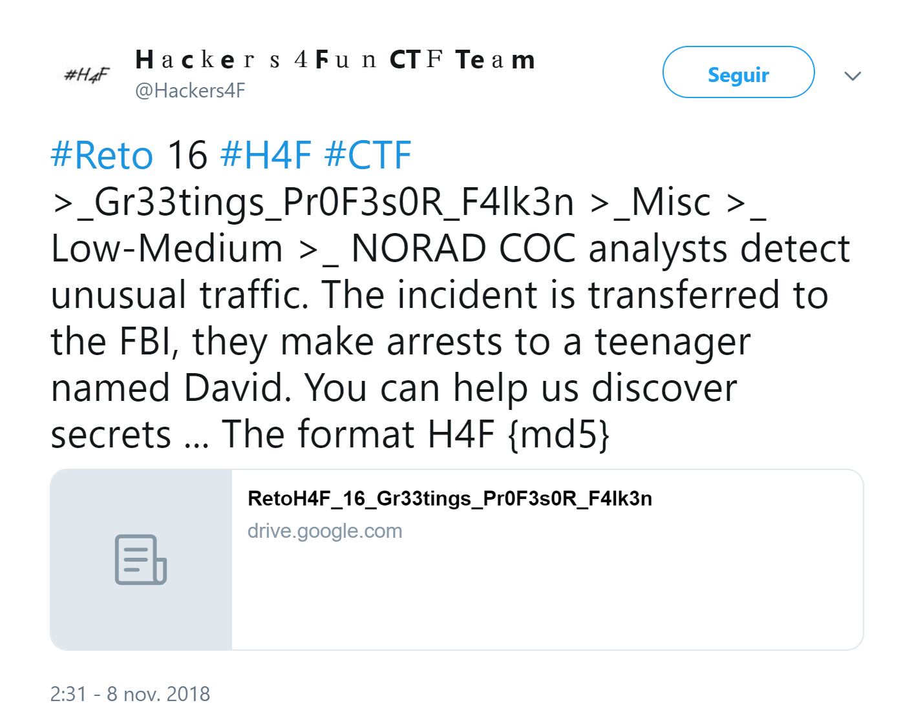
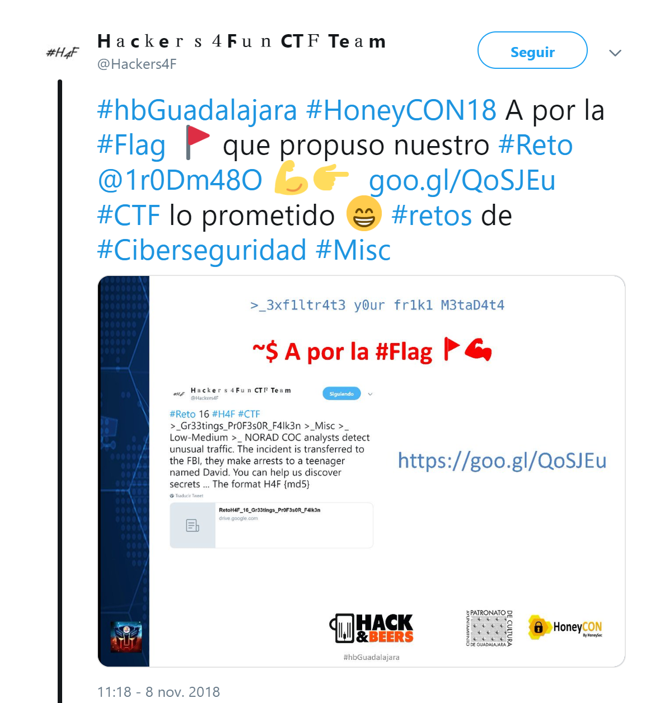

## Description

- **Name:** Gr33tings Pr0F3s0R F4lk3n
- **Release date:** November 8, 2018
- **Author:** [1v4n](https://twitter.com/1r0Dm48O)
- **Category:** Misc
- **Difficulty:** Medium-Low

> NORAD COC analysts detect unusual traffic. The incident is transferred to the FBI, they make arrests to a teenager named David. You can help us discover secrets ...

## Target

> Format of the flag: *flag{md5}*

## Posted

- [Link](https://twitter.com/H4ck3rs4FunCTF/status/1060479987323731968)

## Presented

- [Slides](https://www.slideshare.net/labaliza/exfiltrate-your-friki-metadata-vol2-hackbeers-guadalajara-by-honeycon-vol-3)
- [Link](https://twitter.com/Hackers4F/status/1060612446799515650)

## Writeup

- Author [1v4n Writeup github](https://github.com/hackers4f/hackers4fun-writeups/blob/master/challenges/Misc/Reto_16_H%26B_Gr33tings_Pr0F3s0R_F4lk3n/H%26BGuadalajara-Challenges-Gr33tings%20Pr0F3s0R%20F4lk3n-Misc-1v4n.pdf)

## Mentions

-  👌 Thanks to [@Honey_SEC](https://twitter.com/Honey_SEC) for offering to collaborate in the 🍻🍻🍻 [#hbGuadalajara](https://twitter.com/hashtag/hbGuadalajara) of [@hackandbeers](https://twitter.com/hackandbeers)
