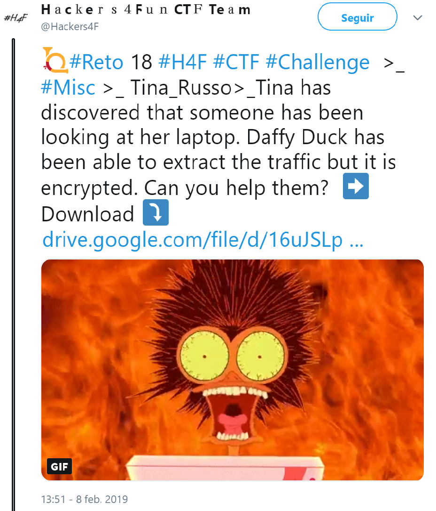

## Description

* **Name:** Tina_Russo
* **Release date:** Febrary 8, 2019
* **Author:** [1v4n](https://twitter.com/1r0Dm48O)
* **Category:** Misc
* **Difficulty:** Medium-Low

> Tina has discovered that someone has been looking at her laptop. Daffy Duck has been able to extract the traffic but it is encrypted. Can you help them?

### Target

> Format of the flag: *H4F{text}*

### Posted

- [Link](https://twitter.com/Hackers4F/status/1093990717502959616)

### Hall of Fame

- 🥇 [@julianmenendez](https://twitter.com/julianmenendez)
- 🥈 [@DarkEagle_CAT](https://twitter.com/DarkEagle_CAT) o [@Litxi](https://twitter.com/Litxi)

### Writeups

- 👍🏆[DarkEagle Writeup](https://github.com/hackers4f/hackers4fun-writeups/blob/master/challenges/Misc/Reto_18_H4F_Tina_Russo/Tina_Russo_Reto_18_H4F_writeup_DarkEagle.pdf)

## Mentions

- 👌 Thanks to [@Morteruelocon](https://twitter.com/morteruelocon) for offering to collaborate in the [#Morteruelo2019](https://twitter.com/hashtag/Morteruelo2019)
