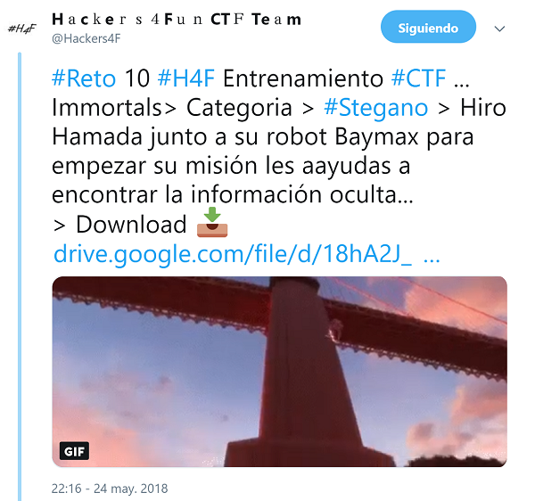

## Description

* **Name:** Immortals
* **Release date:** May 24, 2018
* **Author:** [1v4n](https://twitter.com/1r0Dm48O)
* **Category:** Stego
* **Difficulty:** Low

> Hiro Hamada junto a su robot Baymax para empezar su misión les aayudas a encontrar la información oculta...

### Target

> Format of the flag: *H4F{text}*

### Posted

- [Link](https://twitter.com/Hackers4F/status/999745935835041792)

### Hall of Fame

- 🥇 [@David_Uton](https://twitter.com/David_Uton)
- 🥈 [@therearwindow](https://twitter.com/therearwindow)
- 🥉 [@Frantkdz](https://twitter.com/Frantkdz)

### Writeups

> 👍🏆[David Utón Writeup online](https://elmalodebatman.blogspot.com/2018/05/writeup-reto-10-ctf-hackers4fun-h4f.html) && [David Utón Writeup github](https://github.com/hackers4f/hackers4fun-writeups/blob/master/challenges/Stego/Reto_H4F_10_Immortals/Immortals_Reto_10_H4F_writeup_David_Uton.pdf)

## Mentions

> 👏👏👏 Thanks to [@EastMadH4ck](https://twitter.com/EastMadH4ck) for offering to collaborate in the [#Eastmadhack18](https://twitter.com/hashtag/eastmadhack18?f=tweets&vertical=default&src=hash)
