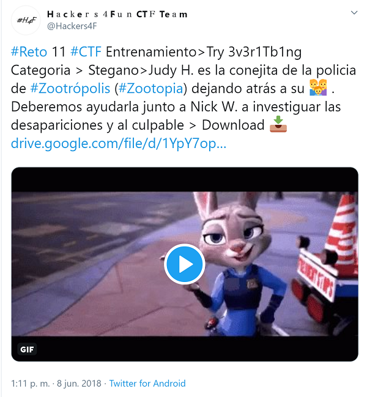

## Description

* **Name:** Try 3v3r1Tb1ng
* **Release date:** Jun 8, 2018
* **Author:** [1v4n](https://twitter.com/1r0Dm48O)
* **Category:** Stego/OSINT
* **Difficulty:** Low/Medium

> Judy H. es la conejita de la policía de #Zootrópolis (#Zootopia) dejando atrás a su 👪 . Deberemos ayudarla junto a Nick W. a investigar las desapariciones y al culpable

### Target

> Format of the flag: *H4F{text}*

### Posted

- [Link](https://twitter.com/Hackers4F/status/1005044551357255680)

### Hall of Fame

- 🥇 [@David_Uton](https://twitter.com/David_Uton)

### Writeups

> 👍🏆[David Utón Writeup online](https://c43s4rs.blogspot.com/2018/06/writeup-reto-h4f-stegano-try-3v3r1tb1ng.html) && [David Utón Writeup github](https://github.com/hackers4f/hackers4fun-writeups/blob/master/challenges/Stego/Reto_H4F_11_Try_3v3r1Tb1ng/C43S4RS_%20Writeup%20Reto%20H4F%20Stegano_%20Try%203v3r1Tb1ng.pdf)
- Author [1v4n Writeup github](https://github.com/hackers4f/hackers4fun-writeups/blob/master/challenges/Stego/Reto_H4F_11_Try_3v3r1Tb1ng/H4F%20-%20Reto%2011%20-%20Try%203v3r1Tb1ng%20-%201v4n.pdf)
