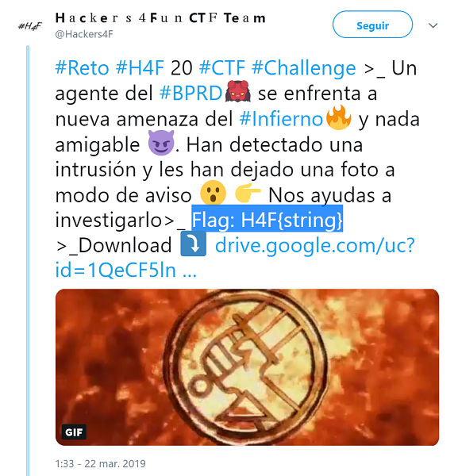

## Description

* **Name:** 0gDrU_J4h4D
* **Release date:** March 22, 2019
* **Author:** [1v4n](https://twitter.com/1r0Dm48O)
* **Category:** Stego
* **Difficulty:** Hard xD

> Un agente del #BPRD se enfrenta a nueva amenaza del #Infierno🔥 y nada amigable 😈. Han detectado una intrusión y les han dejado una foto a modo de aviso 😮 👉 Nos ayudas a investigarlo

### Target

> Format of the flag: *H4F{string}*

### Posted

- [Link](https://twitter.com/Hackers4F/status/1109010112172175360)

### Hall of Fame

- $> 🥇 [@DarkEagle_CAT](https://twitter.com/DarkEagle_CAT)
- 🥈 [@EA4FSV](https://twitter.com/EA4FSV)
- 🥉 [@ariel_anonis](https://twitter.com/ariel_anonis)
- 📝 [@David_Uton](https://twitter.com/David_Uton)

### Writeups

- 👍🏆[David_Uton Writeup Github](https://github.com/hackers4f/hackers4fun-writeups/blob/master/challenges/Stego/Reto_H4F_20_0gDrU_J4h4D/0gDrU_J4h4D_Reto_20_writeup_David_Uton.pdf) && [David_Uton Writeup Online](https://c43s4rs.blogspot.com/2019/03/writeup-hall-of-fame-reto-20-h4f.html)
- 👌[Ariel_Anonis Writeup Github](https://github.com/hackers4f/hackers4fun-writeups/blob/master/challenges/Stego/Reto_H4F_20_0gDrU_J4h4D/0gDrU_J4h4D_Reto_20_writeup_Ariel_Anonis.pdf) && [Ariel_Anonis Github](https://github.com/raa2015/ctf-write-ups/blob/master/Ariel%20Anonis%20-%20Reto%2020%20H4F.pdf)
