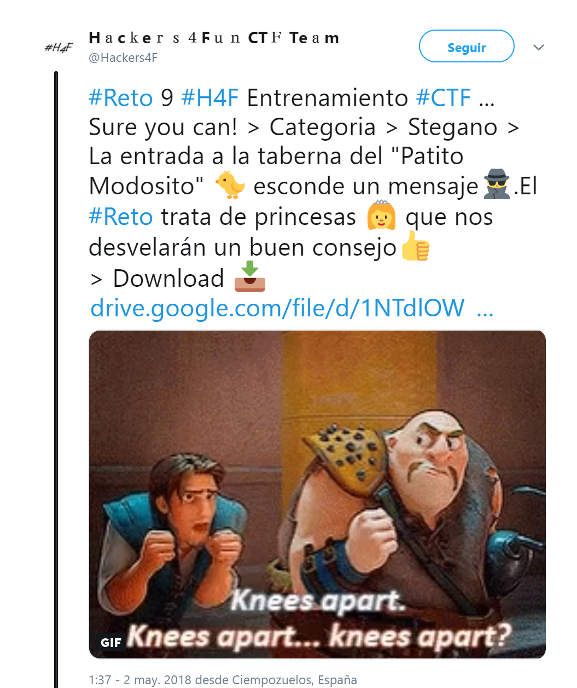
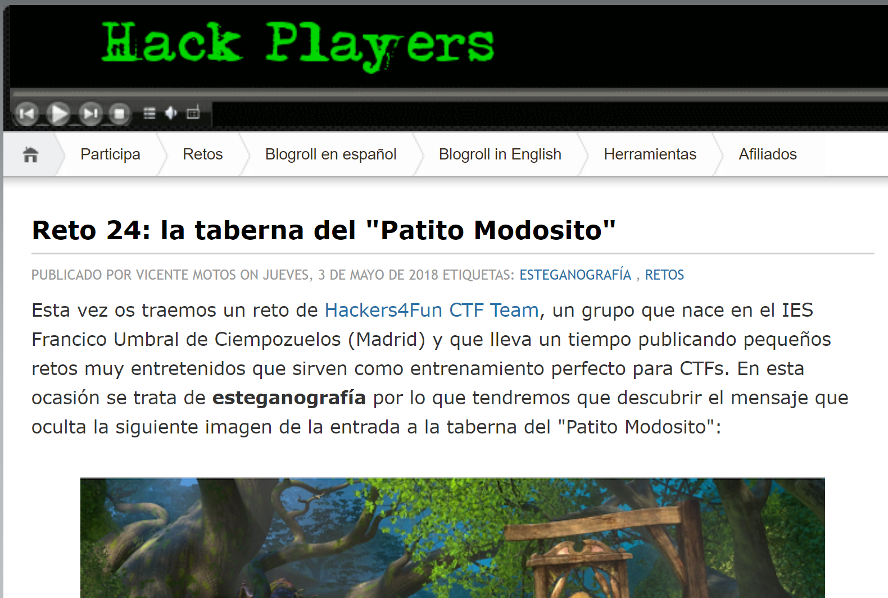

## Description

* **Name:** Sure you can!
* **Release date:** May 2, 2018
* **Author:** [1v4n](https://twitter.com/1r0Dm48O)
* **Category:** Stego
* **Difficulty:** Medium-Low

> La entrada a la taberna del "Patito Modosito" 🐤 esconde un mensaje🕵.El #Reto trata de princesas 👸 que nos desvelarán un buen consejo👍.

### Target

> Format of the flag: *H4F{text}*

### Posted

- [Link](https://twitter.com/Hackers4F/status/991597426581516288)

- [Link](https://www.hackplayers.com/2018/05/reto-24-la-taberna-del-patito-modosito.html)
- [Link Twitter](https://twitter.com/hackplayers/status/991806277922701312)

### Hall of Fame

- 🥇 [@therearwindow](https://twitter.com/therearwindow)
- 🥈 [@David_Uton](https://twitter.com/David_Uton)
- 🥉 [@EA4FSV](https://twitter.com/EA4FSV)
- [@icierva](https://twitter.com/icierva)
- [@Frantkdz](https://twitter.com/Frantkdz)
- [@CyberAlberties](https://twitter.com/CyberAlberties)
- [@sinfocol](https://twitter.com/sinfocol)
- [@KerosenoDev](https://twitter.com/KerosenoDev)

### Writeups

> 👍🏆[David Utón Writeup online](https://www.hackplayers.com/2018/05/solucion-al-reto-25-la-taberna-del-patito.html) && [David Utón Writeup github](https://github.com/hackers4f/hackers4fun-writeups/blob/master/challenges/Stego/Reto_H4F_9_Hackplayers_24_Sure%20you%20can/Sure_you_can_Reto_9_H4F_24_Hackplayers_writeup_David_Uton.pdf)

> [EA4FSV Writeup online](https://www.dropbox.com/sh/2bs63ik4b5vhe70/AAD9ZpojUbTluBjMi8VOUcHJa) && [EA4FSV Writeup github](https://github.com/hackers4f/hackers4fun-writeups/blob/master/challenges/Stego/Reto_H4F_9_Hackplayers_24_Sure%20you%20can/Sure_you_can_Reto_9_H4F_24_Hackplayers_writeup_EAFSV.txt)
> [Frantkdz Writeup online](https://drive.google.com/file/d/1CU-4eSGasO-D0g0C_ba8D1hkw1o8vIYW) && [Frantkdz Writeup github](https://github.com/hackers4f/hackers4fun-writeups/blob/master/challenges/Stego/Reto_H4F_9_Hackplayers_24_Sure%20you%20can/Sure_you_can_Reto_9_H4F_24_Hackplayers_writeup_Frantkdz.pdf)
> [KerosenoDev Writeup online](https://docs.google.com/document/d/1SWqDrb5xfFSj7Rg2E1bVYq9N0m_kHDZFjdGs_khxAbc) && [KerosenoDev Writeup github](https://github.com/hackers4f/hackers4fun-writeups/blob/master/challenges/Stego/Reto_H4F_9_Hackplayers_24_Sure%20you%20can/Sure_you_can_Reto_9_H4F_24_Hackplayers_writeup_KerosenoDev.pdf)

## Mentions

> 👏👏👏 Thanks to [@hackplayers](https://twitter.com/hackplayers) for offering to collaborate in the [#Challenges of Hackplayers](https://www.hackplayers.com/p/retos-de-hackplayers_5.html)
